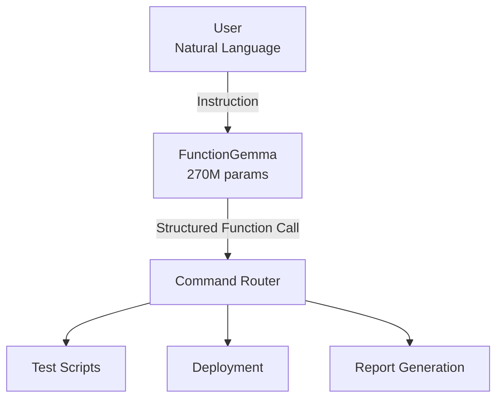

# 🧠 Natural Command Assistant
> **An ultra-lightweight local assistant that converts natural language into structured function calls via FunctionGemma-270M.**


Natural Command Assistant simplifies the execution of complex scripts by converting your text instructions into secure function calls. Powered locally by [FunctionGemma-270M](https://huggingface.co/google/functiongemma-270m-it), it guarantees total confidentiality and deterministic execution without API fees. It is the ideal interface for making your deployment and testing tools accessible to the entire team without the risk of human error.

## 🎯 Business Problem

In many technical teams:

* Scripts already exist (tests, deployments, reports…)
* Commands are complex or poorly documented
* Only a few experts dare to execute them
* Others hesitate for fear of making a mistake

👉 **Real-world consequences**:

* Wasted time
* Dependency on specific individuals
* Human errors
* Friction between Dev, QA, and Product teams

## ✅ The Solution

A **local assistant** that transforms a natural language instruction into a **structured and controlled function call**.

Example:

```text
Run unit test in dev environment
```

⬇️

```python
run_tests(type="unit", environment="dev")
```

The AI **does not make decisions**:
It simply **structures the user's intent** to trigger an authorized action.

## 🧠 Why FunctionGemma?

This project uses **FunctionGemma-270M-IT (Google)**, a model designed **specifically for function calling**.

**Why this choice?**

* 🪶 270M parameters → fast and lightweight
* 🏠 **100% local** execution
* 🔐 Structured and deterministic outputs
* 🧩 Specialized in transforming intent → action
* 💸 Zero API costs, no data sent externally

👉 We don't need a general-purpose chatbot here; we need a **reliable and controllable tool**.

## 🏗️ Architecture



## 🔒 Separation of Concerns

| Component | Role |
| --- | --- |
| LLM | Understands intent and generates a function call |
| Router | Validates and routes the call |
| Business Scripts | Executes only authorized actions |

👉 The model **cannot execute arbitrary code**.

## ⚙️ Exposed Functions (Example)

* `run_tests(type, environment)`
* `deploy_app(version, environment)`
* `generate_test_report(format)`

Each function:

* Is explicitly defined
* Has a strict schema
* Limits possible parameters (whitelist)

## 🚀 Installation

### Prerequisites

* Python 3.12+
* GPU recommended (CPU possible but slower)

```bash
uv venv
source .venv/bin/activate
uv pip install -r requirements.txt
```

## ▶️ Running the Assistant

```bash
uv run python assistant.py
```

Then enter a natural language instruction:

```text
Run unit test in dev environment
Deploy version 1.2.3 to preprod
Generate test report in PDF
```

## 🧪 Real Output Example

Internal model output:

```text
<start_function_call>
call:run_tests{type:<escape>unit<escape>,environment:<escape>dev<escape>}
<end_function_call>
```

Application interpretation:

```text
✅ 'unit' tests launched on the 'dev' environment
```

## 🛡️ Security & Reliability

* ✅ No direct execution from the LLM
* ✅ Actions limited to an authorized list
* ✅ Validated parameters
* ✅ Local model (no data leaks)
* ✅ Reproducible results

## 📈 Business Value

* ⏱️ Operational time savings
* ❌ Reduction of human errors
* 🧑‍🤝‍🧑 Autonomy for non-expert teams
* 🔐 Better control over critical actions
* 💸 Zero AI infrastructure costs

## 🧠 Lessons Learned

* Not all AI use cases **require** a giant LLM.
* The **instruction format** is as important as the model itself.
* Function calling is an excellent business interface.
* Local-first is often an advantage, not a constraint.

## 🔮 Future Roadmap

* `dry-run` mode
* Role management (QA / Dev / Admin)
* Logs & auditing
* CI/CD integration
* Web or Slack interface
* Fine-tuning on internal vocabulary

## 📣 Conclusion

This project demonstrates how to use an LLM **not to replace humans**, but to **simplify access to existing tools**.

👉 The AI becomes the **interface**, not the decision-maker.
